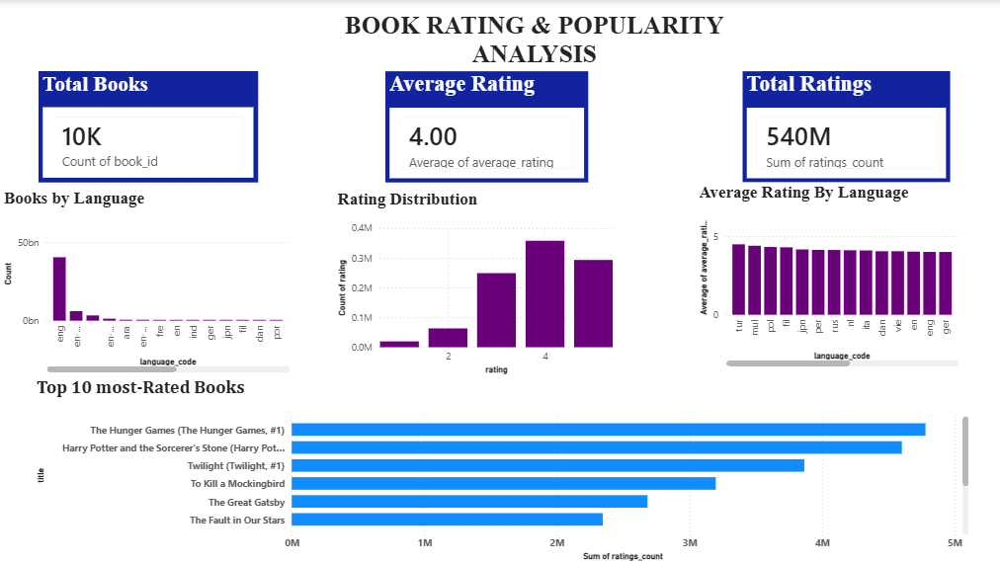

# Book Rating & Popularity Analysis using Power BI

## Dashboard

## Project Overview

A Power BI dashboard for analyzing book ratings, popularity, languages, rating distribution, and the top 10 most-rated books.

## Tools Used
- Power BI Desktop
- Goodbooks-10k Dataset

## Features
- Total Books
- Average Rating
- Total Ratings
- Books by Language
- Rating Distribution
- Average Rating by Language
- Top 10 Most-Rated Books

## Dataset
This project uses the Goodbooks-10k dataset for analyzing book ratings, popularity, languages, and rating distribution.

## Key Insights
- The dataset contains around 10,000 books.
- The overall average book rating is around 4.00.
- Rating 4 is the most common rating.
- English-language books dominate the dataset.
- The dashboard highlights the 10 most-rated books.

  ## Project Files
- `Book_Rating_popularity_Analysis.pbix` – Power BI project file
- `Dashboard.png` – Dashboard preview
- `README.md` – Project documentation
